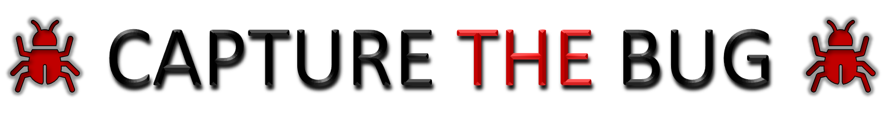

 

  

 

# Capture The Bug - A Design Verification Hackathon

The Design verification for the different designs are provided in the respective directory's README.md file

:open_file_folder:[Multiplexer](/level1_design1/README.md)

:open_file_folder:[Sequence Detector](/level1_design2/README.md)

:open_file_folder: [Bit Manipulation Co-processor](/level2_design/README.md)

:open_file_folder:[RSA Algo](/level3_design/README.md)

---

#  :bookmark: Author
-  Nalinkumar S

# :clipboard: Acknowledments

- Lavanya J, CEO/Founder, Vyoma Systems - lavanya@vyomasystems.com
- Kunal Ghosh, Co-founder, VLSI System Design (VSD) Corp. Pvt. Ltd. - kunalpghosh@gmail.com
