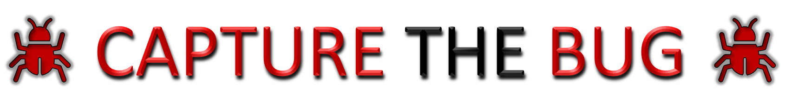

 

  

 

## Capture The Bug - A Design Verification Hackathon

 

## :file_folder: README.md File of Each Design is found in its Respective Directory 

:open_file_folder: [Multiplexer](/level1_design1/README.md)

:open_file_folder: [Sequence Detector](/level1_design2/README.md)

:open_file_folder: [Bit Manipulation Co-processor](/level2_design/README.md)

:open_file_folder: [RSA Algorithm](/level3_design/README.md)

---

#  :bookmark: Author

 🖊️ Nalinkumar S, Final year student, B.E. ECE, Madras Institute of Technology, Anna University, Chennai, India

# :clipboard: Acknowledments

- 🎓 Lavanya J, CEO/Founder, Vyoma Systems - lavanya@vyomasystems.com
- 🎓 Kunal Ghosh, Co-founder, VLSI System Design (VSD) Corp. Pvt. Ltd. - kunalpghosh@gmail.com
