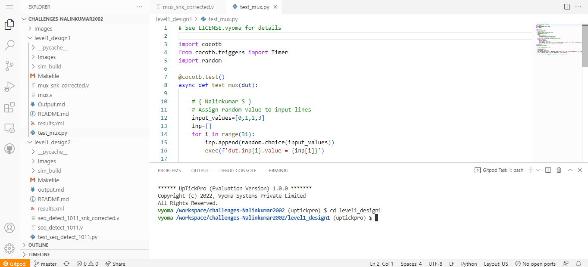
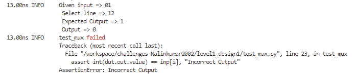
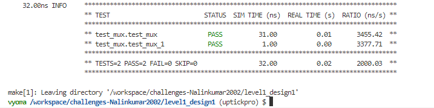

</br>

# 📚 Multiplexer Design Verification - Level 1 -- Design 1
</br>



## 📝 Verification Environment

Vyoma's UpTickPro Tool is used to setup the Verification Environment. Multiplexer design is verified using this Verification Environment

The CoCoTb based Python Test is used to drive inputs to `Design Under Test ( DUT )`


```python
    input_values=[0,1,2,3]
    inp=[]
    for i in range(31):
        inp.append(random.choice(input_values))
        exec(f'dut.inp{i}.value = {inp[i]}')
```

It take 31 inputs - `inp[0]` --> `inp[30]` with any of these two values ` 00 , 01 , 10 , 11  `.

The assert statement is used for comparing the  DUT Output with the Expected Output value.

```python
assert int(dut.out.value) == inp[i], "Incorrect Output"
```
## :bug: Bugs 

## 📋 Test Scenario - 1

```python
for i in range(31):
        dut.sel.value = i
        await Timer(1, units='ns')     
```
Initially, Select lines are looped from 0 - 30. During this the Expected values and DUT values are verified using following command

```python
dut._log.info(f"Given input => {eval(f'dut.inp{i}.value')}\n Select line => {i} \n
                Expected Output => {inp[i]}  \n Output => {int(eval(f'dut.out.value'))} ")
```

## --- :ant: :mag:  Bug --- 1



During Execution Assertion Error is raised when Select line value = 12.

```verilog
 begin
    case(sel)
    5'b01101: out = inp12;           ===> BUG 1
    5'b01101: out = inp13;
    endcase
  end
```

## --- :ant: :wrench:  Bug Fix --- 1

This Bug is fixed by replacing `5'01101: out = 12`  with  `5'b01100: out = inp12;`

```verilog
 begin
    case(sel)
    5'b01100: out = inp12;           ===> BUG FIX 1
    5'b01101: out = inp13;
    endcase
  end
```

## 📋 Test Scenario - 2

```python
    dut.inp30.value = 1
    dut.sel.value = 30
    await Timer(1, units='ns')  
```
## --- :ant: :mag:  Bug --- 2

After the First Bug is fixed, Assertion Error is raised when Select line input = 30


```verilog
 begin
    case(sel)
    5'b11101: out = inp29;
                                     ===> BUG 2
    default: out = 0;
    endcase
  end
  ```
## --- :ant: :wrench:  Bug Fix --- 2

This Bug is fixed by including Select line input statement of 30.

```verilog
 begin
    case(sel)
    5'b11101: out = inp29;
    5'b11110: out = inp30;          ===> BUG FIX 2
    default: out = 0;
    endcase
  end
```
## -- :bug: :hammer: Bug Fixed --



## 📝 Verification Strategy

- Initially All 30 Input lines are assigned with different values
- All possible combination of inputs were tested by varying select line from 0 to 30
- DUT outputs are compared with expected values and design is verified


## 📝 Is the verification complete ?

 - [x] All Possible Select lines Combinations are tested and design bugs are fixed.
 - [x] Test cases are Passed Sucessfully
 
 :calendar: <details> <summary> Test Cases </summary>
    
    ```
     0.00ns INFO     Found test test_mux.test_mux
     0.00ns INFO     Found test test_mux.test_mux_1
     0.00ns INFO     running test_mux (1/2)
     1.00ns INFO     Given input => 01
                      Select line => 0  
                      Expected Output => 1  
                      Output => 1 
     2.00ns INFO     Given input => 11
                      Select line => 1  
                      Expected Output => 3  
                      Output => 3 
     3.00ns INFO     Given input => 01
                      Select line => 2  
                      Expected Output => 1  
                      Output => 1 
     4.00ns INFO     Given input => 01
                      Select line => 3  
                      Expected Output => 1  
                      Output => 1 
     5.00ns INFO     Given input => 00
                      Select line => 4  
                      Expected Output => 0  
                      Output => 0 
     6.00ns INFO     Given input => 01
                      Select line => 5  
                      Expected Output => 1  
                      Output => 1 
     7.00ns INFO     Given input => 10
                      Select line => 6  
                      Expected Output => 2  
                      Output => 2 
     8.00ns INFO     Given input => 01
                      Select line => 7  
                      Expected Output => 1  
                      Output => 1 
     9.00ns INFO     Given input => 10
                      Select line => 8  
                      Expected Output => 2  
                      Output => 2 
    10.00ns INFO     Given input => 10
                      Select line => 9  
                      Expected Output => 2  
                      Output => 2 
    11.00ns INFO     Given input => 01
                      Select line => 10  
                      Expected Output => 1  
                      Output => 1 
    12.00ns INFO     Given input => 00
                      Select line => 11  
                      Expected Output => 0  
                      Output => 0 
    13.00ns INFO     Given input => 10
                      Select line => 12  
                      Expected Output => 2  
                      Output => 2 
    14.00ns INFO     Given input => 00
                      Select line => 13  
                      Expected Output => 0  
                      Output => 0 
    15.00ns INFO     Given input => 10
                      Select line => 14  
                      Expected Output => 2  
                      Output => 2 
    16.00ns INFO     Given input => 00
                      Select line => 15  
                      Expected Output => 0  
                      Output => 0 
    17.00ns INFO     Given input => 10
                      Select line => 16  
                      Expected Output => 2  
                      Output => 2 
    18.00ns INFO     Given input => 11
                      Select line => 17  
                      Expected Output => 3  
                      Output => 3 
    19.00ns INFO     Given input => 11
                      Select line => 18  
                      Expected Output => 3  
                      Output => 3 
    20.00ns INFO     Given input => 11
                      Select line => 19  
                      Expected Output => 3  
                      Output => 3 
    21.00ns INFO     Given input => 10
                      Select line => 20  
                      Expected Output => 2  
                      Output => 2 
    22.00ns INFO     Given input => 10
                      Select line => 21  
                      Expected Output => 2  
                      Output => 2 
    23.00ns INFO     Given input => 00
                      Select line => 22  
                      Expected Output => 0  
                      Output => 0 
    24.00ns INFO     Given input => 01
                      Select line => 23  
                      Expected Output => 1  
                      Output => 1 
    25.00ns INFO     Given input => 01
                      Select line => 24  
                      Expected Output => 1  
                      Output => 1 
    26.00ns INFO     Given input => 10
                      Select line => 25  
                      Expected Output => 2  
                      Output => 2 
    27.00ns INFO     Given input => 01
                      Select line => 26  
                      Expected Output => 1  
                      Output => 1 
    28.00ns INFO     Given input => 01
                      Select line => 27  
                      Expected Output => 1  
                      Output => 1 
    29.00ns INFO     Given input => 00
                      Select line => 28  
                      Expected Output => 0  
                      Output => 0 
    30.00ns INFO     Given input => 00
                      Select line => 29  
                      Expected Output => 0  
                      Output => 0 
    31.00ns INFO     Given input => 00
                      Select line => 30  
                      Expected Output => 0  
                      Output => 0 
    31.00ns INFO     test_mux passed
    31.00ns INFO     running test_mux_1 (2/2)
    32.00ns INFO     Given input => 01
                      Select line : 30  
                      Expected Output => 1  
                      Output => 1 
    32.00ns INFO     test_mux_1 passed
    32.00ns INFO     **************************************************************************************
                     ** TEST                          STATUS  SIM TIME (ns)  REAL TIME (s)  RATIO (ns/s) **
                     **************************************************************************************
                     ** test_mux.test_mux              PASS          31.00           0.01       3455.42  **
                     ** test_mux.test_mux_1            PASS           1.00           0.00       3377.71  **
                     **************************************************************************************
                     ** TESTS=2 PASS=2 FAIL=0 SKIP=0                 32.00           0.02       2000.03  **
                     **************************************************************************************

     ```                
    </details>
 
 
  :heavy_check_mark: Design Verification is Complete
