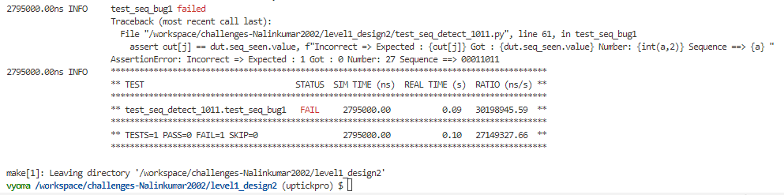
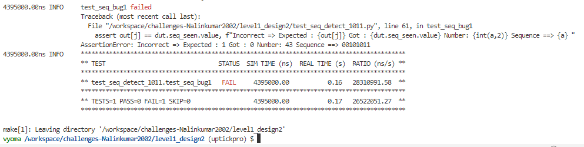
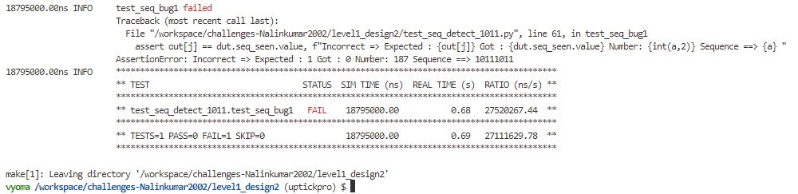
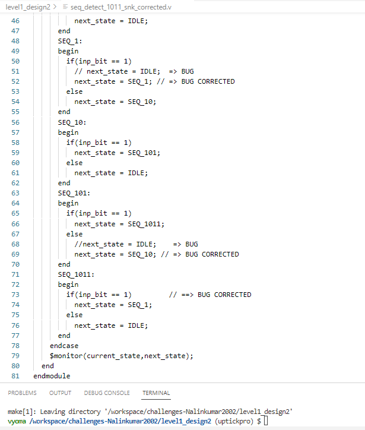
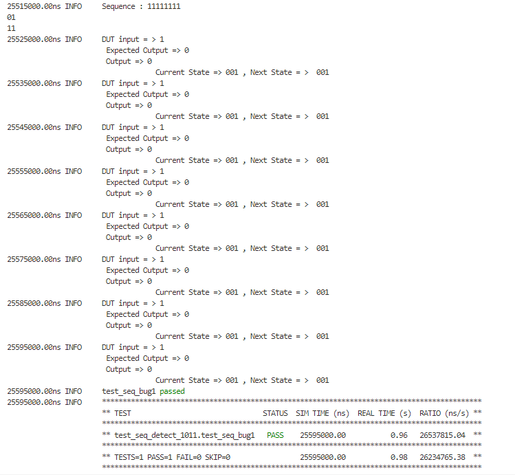

</br>

# 📚 Sequence Detector Design Verification - Level 1 -- Design 2

</br>


## 📝 Verification Environment

Vyoma's UpTickPro Tool is used to setup the Verification Environment. Sequence Detector design is verified using this Verification Environment

The CoCoTb based Python Test is used to drive inputs to `Design Under Test ( DUT )`

Clock is generated by following code

```python
    clock = Clock(dut.clk, 10, units="us") 
    cocotb.start_soon(clock.start())      
```
DUT is reset to IDLE State before driving input values

```python
        dut.reset.value = 1
        await FallingEdge(dut.clk)
        dut.reset.value = 0
        await FallingEdge(dut.clk) 
```

Input is looped by all possible combination of an 8-bit number sequence because it is sufficient that the sequence detector is perfect when it detects two consecutive sequence.

A python logic is written for dectecting the expected output value of sequence detector

```python
        # Logic to Detect the Sequence
        a=format(i, '08b')
        dut._log.info(f"Sequence : {a} ")
        inp=list(a)
        l=a.find('1011')
        m=a.rfind('1011')
        out = [0]*8
        if l == m :
            if (l != -1) :
                out[l+3]=1
        elif l+3 == m :
            out[l+3]=1
        else:
            out[l+3]=1
            out[m+3]=1

```

The assert statement is used for comparing the DUT Output with the Expected Output value

```python
assert out[j] == dut.seq_seen.value, f"Incorrect => Expected : {out[j]} Got : {dut.seq_seen.value} Number: {int(a,2)} Sequence ==> {a} "
```


## :bug: Bugs 

## 📋 Test Scenario 

Intially, Input sequence is started from `8b'00000000`

```python
    for i in range(256):
    
            for j in range(8):

                await Timer(10, units='ns')
                dut.inp_bit.value = int(inp[j])
                await FallingEdge(dut.clk)
            
```

Expected Output values and DUT Output values are verified using following command

```python
            # DUT Values
            dut._log.info(f'DUT input = > {dut.inp_bit.value} \n Expected Output => {out[j]} \n Output => {dut.seq_seen.value} \n \
            Current State => {dut.current_state.value} , Next State = >  {dut.next_state.value}')
```

## --- :ant: :mag:  Bug --- 1

Assertion Error Raises when Input Sequence = 00011011



With respect to previous passed sequence the design bug can be spotted easily. 

The sequence 00010110 & 00010111 was passed sucessfully. So, the bug lies in SEQ1 state

```verilog
SEQ_1:
      begin
        if(inp_bit == 1)
          next_state = IDLE;        // => BUG
        else
          next_state = SEQ_10;
      end

```


## --- :ant: :wrench:  Bug Fix --- 1

This bug is fixed by following logic.

```verilog
SEQ_1:
      begin
        if(inp_bit == 1)
          next_state = SEQ_1;      // => BUG CORRECTED
        else
          next_state = SEQ_10;
      end
```


## --- :ant: :mag:  Bug --- 2

After fixing the previous bug  next Assertion Error Raises when Input Sequence = 00101011



The bug lies in SEQ101 state because sequence 8b'00001011 is passed sucessfully.

```verilog
      SEQ_101:
      begin
        if(inp_bit == 1)
          next_state = SEQ_1011;
        else
          next_state = IDLE;         //  => BUG
      end
```

## --- :ant: :wrench:  Bug Fix --- 2

The bug is fixed by following logic

```verilog
      SEQ_101:
      begin
        if(inp_bit == 1)
          next_state = SEQ_1011;
        else
          next_state = SEQ_10;         // => BUG CORRECTED
      end
```

## --- :ant: :mag:  Bug --- 3

Assertion Error Raises when Input Sequence = 10111011



The bug lies in SEQ1011 state because sequence 8b'00001011 is passed sucessfully.

```verilog
      SEQ_1011:
      begin
          next_state = IDLE;    //  => BUG
      end

```

## --- :ant: :wrench:  Bug Fix --- 3

The bug is fixed by following logic

```verilog
      SEQ_1011:
      begin
        if(inp_bit == 1)         // ==> BUG CORRECTED
          next_state = SEQ_1;
        else
          next_state = IDLE;
      end
```


## -- :bug: :hammer: Bug Fixed --

Bugs are Fixed and Test cases run successfully






## 📝 Verification Strategy

- Initially all possible combination of an 8-bit number sequence because it is sufficient that the sequence detector is perfect when it detects two consecutive sequence
- DUT output values are compared with expected values and design is being verified


## 📝 Is the verification complete ?

 - [x] All Possible Combinations of an 8-bit number sequences are tested and design bugs are fixed.
 - [x] Test cases are Passed Sucessfully
 
 <details>
 <summary> Test Cases => Also available in 'Output.md' </summary>
 
```  
------------------ For Full Test Case Refer => " Output.md " File ------------------------

     0.00ns INFO     Found test test_seq_detect_1011.test_seq_bug1
     0.00ns INFO     running test_seq_bug1 (1/1)
 15000.00ns INFO     Sequence : 00000000 
 25000.00ns INFO     DUT input = > 0 
                      Expected Output => 0 
                      Output => 0 
                                  Current State => 000 , Next State = >  000
 35000.00ns INFO     DUT input = > 0 
                      Expected Output => 0 
                      Output => 0 
                                  Current State => 000 , Next State = >  000
 45000.00ns INFO     DUT input = > 0 
                      Expected Output => 0 
                      Output => 0 
                                  Current State => 000 , Next State = >  000
 55000.00ns INFO     DUT input = > 0 
                      Expected Output => 0 
                      Output => 0 
                                  Current State => 000 , Next State = >  000
 65000.00ns INFO     DUT input = > 0 
                      Expected Output => 0 
                      Output => 0 
                                  Current State => 000 , Next State = >  000
 75000.00ns INFO     DUT input = > 0 
                      Expected Output => 0 
                      Output => 0 
                                  Current State => 000 , Next State = >  000
 85000.00ns INFO     DUT input = > 0 
                      Expected Output => 0 
                      Output => 0 
                                  Current State => 000 , Next State = >  000
 95000.00ns INFO     DUT input = > 0 
                      Expected Output => 0 
                      Output => 0 
                                  Current State => 000 , Next State = >  000
 95000.00ns INFO     
                     ----------------------
                     
                     .
                     .
                     .
                     .
                     .
                        
25215000.00ns INFO     Sequence : 11111100 
25225000.00ns INFO     DUT input = > 1 
                        Expected Output => 0 
                        Output => 0 
                                    Current State => 001 , Next State = >  001
25235000.00ns INFO     DUT input = > 1 
                        Expected Output => 0 
                        Output => 0 
                                    Current State => 001 , Next State = >  001
25245000.00ns INFO     DUT input = > 1 
                        Expected Output => 0 
                        Output => 0 
                                    Current State => 001 , Next State = >  001
25255000.00ns INFO     DUT input = > 1 
                        Expected Output => 0 
                        Output => 0 
                                    Current State => 001 , Next State = >  001
25265000.00ns INFO     DUT input = > 1 
                        Expected Output => 0 
                        Output => 0 
                                    Current State => 001 , Next State = >  001
25275000.00ns INFO     DUT input = > 1 
                        Expected Output => 0 
                        Output => 0 
                                    Current State => 001 , Next State = >  001
25285000.00ns INFO     DUT input = > 0 
                        Expected Output => 0 
                        Output => 0 
                                    Current State => 010 , Next State = >  000
25295000.00ns INFO     DUT input = > 0 
                        Expected Output => 0 
                        Output => 0 
                                    Current State => 000 , Next State = >  000
25295000.00ns INFO     
                       ----------------------
                        
25315000.00ns INFO     Sequence : 11111101 
25325000.00ns INFO     DUT input = > 1 
                        Expected Output => 0 
                        Output => 0 
                                    Current State => 001 , Next State = >  001
25335000.00ns INFO     DUT input = > 1 
                        Expected Output => 0 
                        Output => 0 
                                    Current State => 001 , Next State = >  001
25345000.00ns INFO     DUT input = > 1 
                        Expected Output => 0 
                        Output => 0 
                                    Current State => 001 , Next State = >  001
25355000.00ns INFO     DUT input = > 1 
                        Expected Output => 0 
                        Output => 0 
                                    Current State => 001 , Next State = >  001
25365000.00ns INFO     DUT input = > 1 
                        Expected Output => 0 
                        Output => 0 
                                    Current State => 001 , Next State = >  001
25375000.00ns INFO     DUT input = > 1 
                        Expected Output => 0 
                        Output => 0 
                                    Current State => 001 , Next State = >  001
25385000.00ns INFO     DUT input = > 0 
                        Expected Output => 0 
                        Output => 0 
                                    Current State => 010 , Next State = >  000
25395000.00ns INFO     DUT input = > 1 
                        Expected Output => 0 
                        Output => 0 
                                    Current State => 011 , Next State = >  100
25395000.00ns INFO     
                       ----------------------
                        
25415000.00ns INFO     Sequence : 11111110 
25425000.00ns INFO     DUT input = > 1 
                        Expected Output => 0 
                        Output => 0 
                                    Current State => 001 , Next State = >  001
25435000.00ns INFO     DUT input = > 1 
                        Expected Output => 0 
                        Output => 0 
                                    Current State => 001 , Next State = >  001
25445000.00ns INFO     DUT input = > 1 
                        Expected Output => 0 
                        Output => 0 
                                    Current State => 001 , Next State = >  001
25455000.00ns INFO     DUT input = > 1 
                        Expected Output => 0 
                        Output => 0 
                                    Current State => 001 , Next State = >  001
25465000.00ns INFO     DUT input = > 1 
                        Expected Output => 0 
                        Output => 0 
                                    Current State => 001 , Next State = >  001
25475000.00ns INFO     DUT input = > 1 
                        Expected Output => 0 
                        Output => 0 
                                    Current State => 001 , Next State = >  001
25485000.00ns INFO     DUT input = > 1 
                        Expected Output => 0 
                        Output => 0 
                                    Current State => 001 , Next State = >  001
25495000.00ns INFO     DUT input = > 0 
                        Expected Output => 0 
                        Output => 0 
                                    Current State => 010 , Next State = >  000
25495000.00ns INFO     
                       ----------------------
                        
25515000.00ns INFO     Sequence : 11111111 
25525000.00ns INFO     DUT input = > 1 
                        Expected Output => 0 
                        Output => 0 
                                    Current State => 001 , Next State = >  001
25535000.00ns INFO     DUT input = > 1 
                        Expected Output => 0 
                        Output => 0 
                                    Current State => 001 , Next State = >  001
25545000.00ns INFO     DUT input = > 1 
                        Expected Output => 0 
                        Output => 0 
                                    Current State => 001 , Next State = >  001
25555000.00ns INFO     DUT input = > 1 
                        Expected Output => 0 
                        Output => 0 
                                    Current State => 001 , Next State = >  001
25565000.00ns INFO     DUT input = > 1 
                        Expected Output => 0 
                        Output => 0 
                                    Current State => 001 , Next State = >  001
25575000.00ns INFO     DUT input = > 1 
                        Expected Output => 0 
                        Output => 0 
                                    Current State => 001 , Next State = >  001
25585000.00ns INFO     DUT input = > 1 
                        Expected Output => 0 
                        Output => 0 
                                    Current State => 001 , Next State = >  001
25595000.00ns INFO     DUT input = > 1 
                        Expected Output => 0 
                        Output => 0 
                                    Current State => 001 , Next State = >  001
25595000.00ns INFO     
                       ----------------------
                        
25595000.00ns INFO     test_seq_bug1 passed
25595000.00ns INFO     ********************************************************************************************
                       ** TEST                                STATUS  SIM TIME (ns)  REAL TIME (s)  RATIO (ns/s) **
                       ********************************************************************************************
                       ** test_seq_detect_1011.test_seq_bug1   PASS    25595000.00           0.78   33022815.63  **
                       ********************************************************************************************
                       ** TESTS=1 PASS=1 FAIL=0 SKIP=0                 25595000.00           0.79   32589225.59  **
                       ********************************************************************************************
                       
                       
```
</details>

 
:heavy_check_mark: Design Verification is Complete
