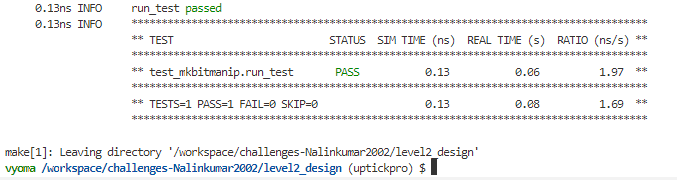

</br>

# 📚 32 - Bit Manupulation Co-Processor Design Verification -- Level 2

</br>


## 📝 Verification Environment

Vyoma's UpTickPro Tool is used to setup the Verification Environment. 32 - Bit Manupulation Co-Processor Design is verified using this Verification Environment

The CoCoTb based Python Test is used to drive inputs to `Design Under Test ( DUT )`

Clock is generated by following code

```python 

def clock_gen(signal):
    while True:
        signal.value = 0
        yield Timer(1) 
        signal.value = 1
        yield Timer(1)     
        
cocotb.fork(clock_gen(dut.CLK))

```
DUT is reset to IDLE State before driving input values

```python
    dut.RST_N.value = 0
    yield Timer(10) 
    dut.RST_N.value = 1

```

Initially, given model python file `model_mkbitmanip.py` is analyzed and all possible instructions are transformed into hex values using help of excel

Instruction Sheet where Don'care `X` in instructions is considered as 0


Instruction Sheet where Don'care `X` in instructions is considered as 1


All these Instructions are converted into list form 

```python

ins = [ '40007033',  '40006033', '40004033', '20001033', '20005033', '60001033', '60005033', '20002033', '20004033', '20006033', '48001033', '28001033', '68001033', '48005033', '28005033', '68005033', '6001033', '6005033', '4001033', '4005033', '60001013', '60101013', '60201013', '60401013', '60501013', '61001013', '61101013', '61201013', '61801013', '61901013', '61a01013', 'a001033', 'a003033', 'a002033', 'a004033', 'a005033', 'a006033', 'a007033', '48006033', '8006033', '8004033', '48004033', '8007033', '20001013', '20005013', '60005013', '48001013', '28001013', '68001013', '48005013', '8001033', '8005033', '8001013', '8005013', '28005013', '68005013', '4005013', '48007033',

        '41ffffb3', '41ffefb3', '41ffcfb3', '21ff9fb3', '21ffdfb3', '61ff9fb3', '61ffdfb3', '21ffafb3', '21ffcfb3', '21ffefb3', '49ff9fb3', '29ff9fb3', '69ff9fb3', '49ffdfb3', '29ffdfb3', '69ffdfb3', 'ffff9fb3', 'ffffdfb3', 'fdff9fb3', 'fdffdfb3', '600f9f93', '601f9f93', '602f9f93', '604f9f93', '605f9f93', '610f9f93', '611f9f93', '612f9f93', '618f9f93', '619f9f93', '61af9f93', 'bff9fb3', 'bffbfb3', 'bffafb3', 'bffcfb3', 'bffdfb3', 'bffefb3', 'bffffb3', '49ffefb3', '9ffefb3', '9ffcfb3', '49ffcfb3', '9ffffb3', '27ff9f93', '23ffdf93', '63ffdf93', '4fff9f93', '2fff9f93', '6fff9f93', '4fffdf93', '9ff9fb3', '9ffdfb3', 'bff9f93', 'bffdf93', '2bffdf93', '6bffdf93', 'ffffdf93', '49ffffb3']
            
```   

Random inputs values are given to src1, src2, src3 

```python
    mav_putvalue_src1 = random.randint(0, pow(2,32)-1)
    mav_putvalue_src2 = random.randint(0, pow(2,32)-1)
    mav_putvalue_src3 = random.randint(0, pow(2,32)-1)
```

Reference Python model file is called by following code

```python
expected_mav_putvalue = bitmanip(mav_putvalue_instr, mav_putvalue_src1, mav_putvalue_src2, mav_putvalue_src3)

```

The assert statement is used for comparing the DUT Output with the Expected Output value

```python
error_message = f'Value mismatch DUT = {hex(dut_output)} does not match MODEL = {hex(expected_mav_putvalue)}'
assert dut_output == expected_mav_putvalue, error_message
```


## :bug: Bugs 

## 📋 Test Scenario 

Looping all possible instructions combinations in the list.

```python

    for i in ins:
    
        mav_putvalue_instr = int(i,16)
        expected_mav_putvalue = bitmanip(mav_putvalue_instr, mav_putvalue_src1, mav_putvalue_src2, mav_putvalue_src3)
        yield Timer(1) 
        dut_output = dut.mav_putvalue.value
            
```

Expected Output values and DUT Output values are verified using following command

```python
        cocotb.log.info(f'DUT OUTPUT={hex(dut_output)}')
        cocotb.log.info(f'EXPECTED OUTPUT={hex(expected_mav_putvalue)}')
```

## --- :ant: :mag:  Bug --- 1

Assertion Error Raises when Instruction value is '0x40007033'  or '0x41ffffb3' which Corresponds to `ANDN` Instruction 


```verilog
// mkbitmanip.v 
// Line 3911
  
assign x__h39889 = mav_putvalue_src1 & mav_putvalue_src2 ;      // ==> BUG

```


## --- :ant: :wrench:  Bug Fix --- 1

This bug is fixed by following logic by comparing with model python file

```python
    if((func7 == "0100000") and (func3 == "111") and (opcode == "0110011") ):
        print('\n--ANDN 1')
        mav_putvalue=mav_putvalue_src1 & (~mav_putvalue_src2)
        mav_putvalue=mav_putvalue & 0xffffffff
        mav_putvalue=(mav_putvalue<<1)|1
        return mav_putvalue
```

```verilog
// mkbitmanip_snk_corrected.v 
// Line 3911

  assign x__h39889 = mav_putvalue_src1 & ~mav_putvalue_src2 ;            //  ====> BUG CORRECTED
  
```

## --- :ant: :mag:  Bug --- 2

After fixing the previous bug next Assertion Error Raises when Input Instruction value is '0x6001033'  or  '0xffff9fb3' which Corresponds to `CMIX` Instruction 


```verilog
// mkbitmanip.v 
// Line 2728

    assign field1__h2958 = x__h39889 | y__h39890 ;   // ==> BUG
    
```

## --- :ant: :wrench:  Bug Fix --- 2

```verilog
// mkbitmanip_snk_corrected.v 
// Line 2728

  assign field1__h2958 =  (mav_putvalue_src1 & mav_putvalue_src2) | y__h39890 ;   // ==> BUG CORRECTED
  
```


## -- :bug: :hammer: Bug Fixed --

Bugs are Fixed and Test cases are successfully passed




## 📝 Verification Strategy

- Initially all possible combination of an 8-bit number sequence because it is sufficient that the sequence detector is perfect when it detects two consecutive sequence
- DUT output values are compared with expected values and design is being verified


## 📝 Is the verification complete ?

 - [x] All Possible Combinations of an 8-bit number sequences are tested and design bugs are fixed.
 - [x] Test cases are Passed Sucessfully
 
 <details>
 <summary> Test Cases => Also available in 'Output.md' </summary>
 
```  
------------------ For Full Test Case Refer => " Output.md " File ------------------------

     0.00ns INFO     Found test test_seq_detect_1011.test_seq_bug1
     0.00ns INFO     running test_seq_bug1 (1/1)
 15000.00ns INFO     Sequence : 00000000 
 25000.00ns INFO     DUT input = > 0 
                      Expected Output => 0 
                      Output => 0 
                                  Current State => 000 , Next State = >  000
 35000.00ns INFO     DUT input = > 0 
                      Expected Output => 0 
                      Output => 0 
                                  Current State => 000 , Next State = >  000
 45000.00ns INFO     DUT input = > 0 
                      Expected Output => 0 
                      Output => 0 
                                  Current State => 000 , Next State = >  000
 55000.00ns INFO     DUT input = > 0 
                      Expected Output => 0 
                      Output => 0 
                                  Current State => 000 , Next State = >  000
 65000.00ns INFO     DUT input = > 0 
                      Expected Output => 0 
                      Output => 0 
                                  Current State => 000 , Next State = >  000
 75000.00ns INFO     DUT input = > 0 
                      Expected Output => 0 
                      Output => 0 
                                  Current State => 000 , Next State = >  000
 85000.00ns INFO     DUT input = > 0 
                      Expected Output => 0 
                      Output => 0 
                                  Current State => 000 , Next State = >  000
 95000.00ns INFO     DUT input = > 0 
                      Expected Output => 0 
                      Output => 0 
                                  Current State => 000 , Next State = >  000
 95000.00ns INFO     
                     ----------------------
                     
                     .
                     .
                     .
                     .
                     .
                        
25215000.00ns INFO     Sequence : 11111100 
25225000.00ns INFO     DUT input = > 1 
                        Expected Output => 0 
                        Output => 0 
                                    Current State => 001 , Next State = >  001
25235000.00ns INFO     DUT input = > 1 
                        Expected Output => 0 
                        Output => 0 
                                    Current State => 001 , Next State = >  001
25245000.00ns INFO     DUT input = > 1 
                        Expected Output => 0 
                        Output => 0 
                                    Current State => 001 , Next State = >  001
25255000.00ns INFO     DUT input = > 1 
                        Expected Output => 0 
                        Output => 0 
                                    Current State => 001 , Next State = >  001
25265000.00ns INFO     DUT input = > 1 
                        Expected Output => 0 
                        Output => 0 
                                    Current State => 001 , Next State = >  001
25275000.00ns INFO     DUT input = > 1 
                        Expected Output => 0 
                        Output => 0 
                                    Current State => 001 , Next State = >  001
25285000.00ns INFO     DUT input = > 0 
                        Expected Output => 0 
                        Output => 0 
                                    Current State => 010 , Next State = >  000
25295000.00ns INFO     DUT input = > 0 
                        Expected Output => 0 
                        Output => 0 
                                    Current State => 000 , Next State = >  000
25295000.00ns INFO     
                       ----------------------
                        
25315000.00ns INFO     Sequence : 11111101 
25325000.00ns INFO     DUT input = > 1 
                        Expected Output => 0 
                        Output => 0 
                                    Current State => 001 , Next State = >  001
25335000.00ns INFO     DUT input = > 1 
                        Expected Output => 0 
                        Output => 0 
                                    Current State => 001 , Next State = >  001
25345000.00ns INFO     DUT input = > 1 
                        Expected Output => 0 
                        Output => 0 
                                    Current State => 001 , Next State = >  001
25355000.00ns INFO     DUT input = > 1 
                        Expected Output => 0 
                        Output => 0 
                                    Current State => 001 , Next State = >  001
25365000.00ns INFO     DUT input = > 1 
                        Expected Output => 0 
                        Output => 0 
                                    Current State => 001 , Next State = >  001
25375000.00ns INFO     DUT input = > 1 
                        Expected Output => 0 
                        Output => 0 
                                    Current State => 001 , Next State = >  001
25385000.00ns INFO     DUT input = > 0 
                        Expected Output => 0 
                        Output => 0 
                                    Current State => 010 , Next State = >  000
25395000.00ns INFO     DUT input = > 1 
                        Expected Output => 0 
                        Output => 0 
                                    Current State => 011 , Next State = >  100
25395000.00ns INFO     
                       ----------------------
                        
25415000.00ns INFO     Sequence : 11111110 
25425000.00ns INFO     DUT input = > 1 
                        Expected Output => 0 
                        Output => 0 
                                    Current State => 001 , Next State = >  001
25435000.00ns INFO     DUT input = > 1 
                        Expected Output => 0 
                        Output => 0 
                                    Current State => 001 , Next State = >  001
25445000.00ns INFO     DUT input = > 1 
                        Expected Output => 0 
                        Output => 0 
                                    Current State => 001 , Next State = >  001
25455000.00ns INFO     DUT input = > 1 
                        Expected Output => 0 
                        Output => 0 
                                    Current State => 001 , Next State = >  001
25465000.00ns INFO     DUT input = > 1 
                        Expected Output => 0 
                        Output => 0 
                                    Current State => 001 , Next State = >  001
25475000.00ns INFO     DUT input = > 1 
                        Expected Output => 0 
                        Output => 0 
                                    Current State => 001 , Next State = >  001
25485000.00ns INFO     DUT input = > 1 
                        Expected Output => 0 
                        Output => 0 
                                    Current State => 001 , Next State = >  001
25495000.00ns INFO     DUT input = > 0 
                        Expected Output => 0 
                        Output => 0 
                                    Current State => 010 , Next State = >  000
25495000.00ns INFO     
                       ----------------------
                        
25515000.00ns INFO     Sequence : 11111111 
25525000.00ns INFO     DUT input = > 1 
                        Expected Output => 0 
                        Output => 0 
                                    Current State => 001 , Next State = >  001
25535000.00ns INFO     DUT input = > 1 
                        Expected Output => 0 
                        Output => 0 
                                    Current State => 001 , Next State = >  001
25545000.00ns INFO     DUT input = > 1 
                        Expected Output => 0 
                        Output => 0 
                                    Current State => 001 , Next State = >  001
25555000.00ns INFO     DUT input = > 1 
                        Expected Output => 0 
                        Output => 0 
                                    Current State => 001 , Next State = >  001
25565000.00ns INFO     DUT input = > 1 
                        Expected Output => 0 
                        Output => 0 
                                    Current State => 001 , Next State = >  001
25575000.00ns INFO     DUT input = > 1 
                        Expected Output => 0 
                        Output => 0 
                                    Current State => 001 , Next State = >  001
25585000.00ns INFO     DUT input = > 1 
                        Expected Output => 0 
                        Output => 0 
                                    Current State => 001 , Next State = >  001
25595000.00ns INFO     DUT input = > 1 
                        Expected Output => 0 
                        Output => 0 
                                    Current State => 001 , Next State = >  001
25595000.00ns INFO     
                       ----------------------
                        
25595000.00ns INFO     test_seq_bug1 passed
25595000.00ns INFO     ********************************************************************************************
                       ** TEST                                STATUS  SIM TIME (ns)  REAL TIME (s)  RATIO (ns/s) **
                       ********************************************************************************************
                       ** test_seq_detect_1011.test_seq_bug1   PASS    25595000.00           0.78   33022815.63  **
                       ********************************************************************************************
                       ** TESTS=1 PASS=1 FAIL=0 SKIP=0                 25595000.00           0.79   32589225.59  **
                       ********************************************************************************************
                       
                       
```
</details>

 
:heavy_check_mark: Design Verification is Complete
