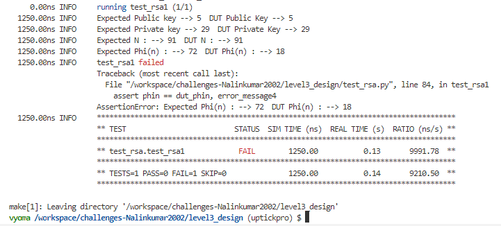
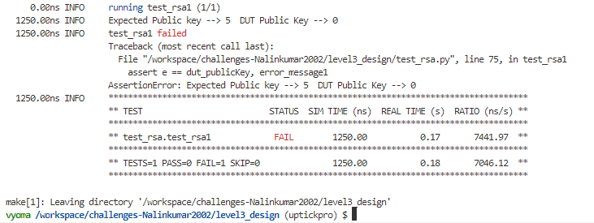
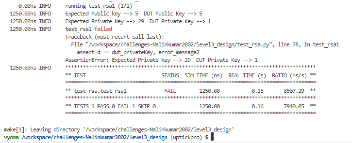
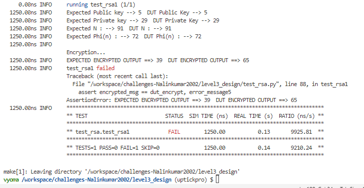
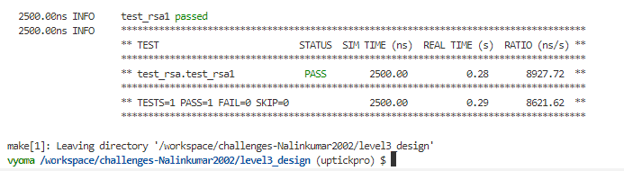

</br>

# 📚 RSA Algorithm Design Verification -- Level 3

</br>


## 📝 Verification Environment

Vyoma's UpTickPro Tool is used to setup the Verification Environment. RSA Algorithm design is verified using this Verification Environment

The CoCoTb based Python Test is used to drive inputs to `Design Under Test ( DUT )`

Clock is generated by following code

```python
    clock = Clock(dut.clk, 10, units="us") 
    cocotb.start_soon(clock.start())      
```


A python model is written for dectecting the expected output value of RSA Algorithm

```
def model_rsa(msg,p,q):

    public, private, phi = generate_keypair( p, q)
    e,n = public
    d,n = private 
    encrypted_msg = encrypt(msg, public)
    decrypted_msg=decrypt(encrypted_msg, private) 
    return msg,e,d,n,phi,encrypted_msg,decrypted_msg

```

Input Message and two Prime Numbers p, q are assigned and passed to model to get the expected Output

```python

    msg_in = 65
    prime1 = 7
    prime2 = 13

    msg,e,d,n,phin,encrypted_msg,decrypted_msg = model_rsa(msg_in,prime1,prime2)
```

Inputs value of DUT are initialized

```python
     # Initialize
    dut.Input.value = 0
    dut.prime_p.value = 0
    dut.prime_q.value = 0
    dut.start.value = 0
    dut.start1.value = 0
    dut.start2.value = 0
    await Timer(100, units='ns')
    
    dut.Input.value = msg_in
    dut.prime_p.value = prime1
    dut.prime_q.value = prime2
    await Timer(100, units='ns')
      
```


The assert statement is used for comparing the DUT Output with the Expected Output value

```python

    error_message1 = f'Expected Public key --> {e}  DUT Public Key --> {int(dut_publicKey)}'
    error_message2 = f'Expected Private key --> {d}  DUT Private Key --> {(dut_privateKey)}'
    error_message3 = f'Expected N : --> {n}  DUT N : --> {(dut_n)}'
    error_message4 = f'Expected Phi(n) : --> {phin}  DUT Phi(n) : --> {(dut_phin)}'
    error_message5 = f'EXPECTED ENCRYPTED OUTPUT ==> {(encrypted_msg)}  DUT ENCRYPTED OUTPUT ==> {(dut_encrypt)} '
    error_message6 = f'EXPECTED DECRYPTED OUTPUT ==> {int(decrypted_msg)}  DUT DECRYPTED OUTPUT ==> {int(dut_decrypt)} '  


    assert e == dut_publicKey, error_message1  
    assert d == dut_privateKey, error_message2   
    assert n == dut_n, error_message3    
    assert phin == dut_phin, error_message4  
    assert encrypted_msg == dut_encrypt, error_message5   
    assert decrypted_msg == dut_decrypt, error_message6

```


## :bug: Bugs 

## 📋 Test Scenario 


```python
    
    # RUN SIMULATION 
    
    # KEY GENERATION - PUBLIC KEY
    dut.start.value = 1
    await Timer(50, units='ns')
    dut.start.value = 0
    await Timer(400, units='ns')
    
    # KEY GENERATION - PRIVATE KEY
    dut.start1.value = 1
    await Timer(100, units='ns')
    dut.start1.value = 0
    await Timer(300, units='ns')
    
    # MODULAR EXPONENTIAL
    dut.start2.value = 1
    await Timer(100, units='ns')
    dut.start2.value = 0
    await Timer(100, units='ns')
            
```

Testing can be done with

- Key Generation
- Encryption & Decryption

Expected Output values and DUT Output values are verified using following code

```python

    cocotb.log.info(f'Expected Public key --> {e}  DUT Public Key --> {(dut_publicKey)}')
    cocotb.log.info(f'Expected Private key --> {d}  DUT Private Key --> {(dut_privateKey)}')
    cocotb.log.info(f'Expected N : --> {n}  DUT N : --> {(dut_n)}')
    cocotb.log.info(f'Expected Phi(n) : --> {phin}  DUT Phi(n) : --> {(dut_phin)}')
    cocotb.log.info(f'EXPECTED ENCRYPTED OUTPUT ==> {(encrypted_msg)}  DUT ENCRYPTED OUTPUT ==> {(dut_encrypt)} ')
    cocotb.log.info(f'EXPECTED DECRYPTED OUTPUT ==> {int(decrypted_msg)}  DUT DECRYPTED OUTPUT ==> {int(dut_decrypt)}\n ')

```

## --- :ant: :mag:  Bug --- 1

Assertion Error Raises due to unmatched value of expected phi(n) and DUT phi(n) 



The design bug is shown below

```verilog
// rsa_main_bug.v
// Line 26

	 assign phin=(prime_p-1)+(prime_q-1);  ==> BUG
     
```

## --- :ant: :wrench:  Bug Fix --- 1

This bug is fixed by following logic.

```verilog
// rsa_snk_corrected.v
// Line 24

	 	 assign phin=(prime_p-1)*(prime_q-1);  ==> BUG CORRECTED
     
```


## --- :ant: :mag:  Bug --- 2

Assertion Error Raises due to unmatched value of expected PublicKey and DUT PublicKey



The design bug is shown below


```verilog
// rsa_main_bug.v
// Line 82

always @(posedge clk)
begin
		if(start) begin
		    random <= 6;   // ==> BUG
		end
end
     
```


## --- :ant: :wrench:  Bug Fix --- 2

This bug is fixed by following logic.

```verilog
// rsa_snk_corrected.v
// Line 83


always @(posedge clk)
    begin
		if(start) begin
		    random <= 3;     // ==> BUG CORRECTED
		end
end
     
```


## --- :ant: :mag:  Bug --- 3

Assertion Error Raises due to unmatched value of expected Private Key and DUT Private Key



The design bug is shown below

```verilog
// rsa_main_bug.v
// Line 166

assign d=B;	 // ==> BUG
     
```

## --- :ant: :wrench:  Bug Fix --- 3

This bug is fixed by following logic.


```verilog
// rsa_snk_corrected.v
// Line 167

 assign d=B[31:16];   // BUG CORRECTED
     
```


## --- :ant: :mag:  Bug --- 4

Assertion Error Raises due to unmatched value of expected Encrypted Value and DUT Encrypted Value 



The design bug is shown below


```verilog
// rsa_main_bug.v
// Line 198

    Mpower = M-1;  ==> BUG
     
```


## --- :ant: :wrench:  Bug Fix --- 4

This bug is fixed by following logic.


```verilog
// rsa_snk_corrected.v
// Line 199

	Mpower = M;  ==> BUG CORRECTED
     
```


## -- :bug: :hammer: Bug Fixed --

Bugs are Fixed and Test cases run successfully




## 📝 Verification Strategy

- RSA Model python file was used for getting expected values and process - wise verification is done.   
- DUT output values are compared with expected values and design is being verified


## 📝 Is the verification complete ?

 - [x] Given Input is Encrypted and Decrypted sucessfully as design bugs are fixed.
 - [x] Test cases are Passed Sucessfully
 
 <details>
 <summary> Test Cases => Also available in 'Output.md' </summary>
 
```  
     0.00ns INFO     running test_rsa1 (1/1)
    
  1250.00ns INFO     Expected Public key --> 5  DUT Public Key --> 5
  1250.00ns INFO     Expected Private key --> 29  DUT Private Key --> 29
  1250.00ns INFO     Expected N : --> 91  DUT N : --> 91
  1250.00ns INFO     Expected Phi(n) : --> 72  DUT Phi(n) : --> 72
  1250.00ns INFO     
                     Encryption...
  1250.00ns INFO     EXPECTED ENCRYPTED OUTPUT ==> 39  DUT ENCRYPTED OUTPUT ==> 39 
  2500.00ns INFO     
                     Decryption...
  2500.00ns INFO     EXPECTED DECRYPTED OUTPUT ==> 65  DUT DECRYPTED OUTPUT ==> 65
                      
  2500.00ns INFO     test_rsa1 passed
  2500.00ns INFO     **************************************************************************************
                     ** TEST                          STATUS  SIM TIME (ns)  REAL TIME (s)  RATIO (ns/s) **
                     **************************************************************************************
                     ** test_rsa.test_rsa1             PASS        2500.00           0.30       8330.56  **
                     **************************************************************************************
                     ** TESTS=1 PASS=1 FAIL=0 SKIP=0               2500.00           0.31       8059.02  **
                     **************************************************************************************
                     
                       
                       
```
</details>

 
:heavy_check_mark: Design Verification is Complete
